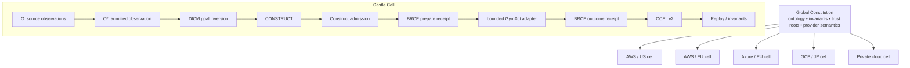

# CASTLE v26.8.18 — Fortune-5 Global Cloud Release

**Release:** `26.8.18`  
**Kind:** `CASTLE_FORTUNE5_GLOBAL_V1`  
**Constitution:** `CONSTRUCT != DO`

v26.8.18 promotes CASTLE from a receipt/admission kernel into a cellular global-cloud runtime contract while preserving the existing DfCM → CONSTRUCT → admission → GymAct → OCEL path.

## Global topology



A cell is `provider × region × authority-domain × residency`. Global CASTLE distributes the constitution; it does not own a universal production credential.

## Runtime shipped

`src/v26_8_18/` adds:

- global constitution identity, ontology version, invariant digest, trust roots, provider-semantics versions and validity window;
- cellular deployment manifests with regional receipt/OCEL durability, workload identities, transition bounds and residency;
- deterministic deployment qualification;
- `O -> O*` source/freshness/epistemic admission;
- normalized CLI/API/MCP/A2A/human/planner/replay intents;
- zero-network/zero-secret air-gap CONSTRUCT bundles;
- BRCE prepare/outcome receipts around every real provider transition;
- a private exact-command GymAct adapter with no implicit shell, cleared inherited environment, bounded output and timeout;
- a public provider execution function that requires the opaque `ConstructAdmission` and routes through the existing exclusive `execute_powl_with_gym_act` path;
- AWS, Azure, GCP, Kubernetes and GitHub adapter-family contracts;
- MCP tools and A2A agent-card semantics with `CONSTRUCT_ONLY` default authority;
- global typed standing instead of an arbitrary scalar risk score.

## No new DO edge

```text
external caller
   |
   +--> SELECT
   +--> CONSTRUCT
   +--> admission
   |
   `--> execute_command_process(opaque ConstructAdmission, ...)
              |
              v
       execute_powl_with_gym_act
              |
              v
        BRCE prepare receipt
              |
              v
       private provider adapter
              |
              v
        BRCE outcome receipt
              |
              v
             OCEL
```

The concrete real adapter is private. An external crate cannot obtain it and bypass `execute_powl_with_gym_act`.

## BRCE law

For every transition:

1. the existing DO path has already revalidated subject, process digest, bounds and expiry against an opaque `ConstructAdmission`;
2. `BrceGymActAdapter` manufactures a signed `CASTLE_BRCE_PREPARE_V1` receipt with the admitted CONSTRUCT as parent;
3. if prepare-receipt manufacture or journal insertion fails, the inner provider adapter is never called;
4. the provider result is bound into `CASTLE_BRCE_OUTCOME_V1` with the prepare artifact as parent;
5. prepare and outcome receipt IDs are copied into the OCEL event attributes;
6. missing outcome receipt makes the transition `BLOCKED`, never `ALIVE`.

Therefore:

```text
no prepare receipt => no official provider actuation
no outcome receipt => no ALIVE transition
```

## Provider execution

A `CommandAdapterPolicy` maps an admitted transition ID to an exact executable and argument vector:

```json
{
  "transition_id": "aws:iam:quarantine-role",
  "program": "aws",
  "args": ["... exact admitted arguments ..."],
  "allowed_exit_codes": [0],
  "max_output_bytes": 65536,
  "timeout_ms": 30000
}
```

The implementation never constructs a shell command. It rejects shell-like executable strings, clears inherited environment variables, uses the cell's named workload identity, kills timed-out processes, hashes retained stdout/stderr with BLAKE3, and converts unmapped transitions, permit mismatch, spawn/wait failure, timeout and non-admitted exit status into refusal.

Provider-specific identity remains local: AWS role, Azure managed identity, GCP workload identity, Kubernetes service account or GitHub App. `ambient_credentials=true` is a release-level typed refusal.

## Deployment manifest

`configs/fortune5-v26.8.18.json` declares five example cells:

| Cell | Provider | Residency | Authority domain |
|---|---|---|---|
| aws-us-east-1-payments | AWS | US | payments-prod-us |
| aws-eu-west-1-commerce | AWS | EU | commerce-prod-eu |
| azure-westeurope-identity | Azure | EU | identity-prod-eu |
| gcp-asia-northeast1-analytics | GCP | JP | analytics-prod-jp |
| private-us-manufacturing | Private cloud | US | manufacturing-private-us |

Required adapter families are AWS, Azure, GCP, Kubernetes and GitHub. The manifest contains identity names, never credential material.

Deployment qualification refuses wrong release identity, malformed/expired/future constitution, missing trust roots, duplicate cells/adapters, missing authority/residency/subject scope, missing local receipt or OCEL durability, zero DO capacity, ambient credentials, missing workload identity, empty transition bounds, provider-semantics drift, missing required providers/adapters and missing CLI/API/MCP/A2A surfaces.

Only zero findings yields `ALIVE`.

## O -> O*

`admit_observation()` requires observation and subject identity, an explicitly allowed source, `OBSERVED` epistemic class, a non-future timestamp and evidence freshness within the configured window. Rejected telemetry never silently becomes planner truth.

## Protocol parity

All transports normalize to:

```text
request_id
origin = cli | api | mcp | a2a | human | planner | replay
mode   = select | construct | do
subject
operation
payload
construct_admission_digest?
prepare_receipt_digest?
```

SELECT and CONSTRUCT are inert. A DO-shaped transport request is refused without both receipt identities, and transport hashes still cannot fabricate the opaque in-process `ConstructAdmission` required by actual execution.

MCP exposes `castle.select`, `castle.construct`, and consequential `castle.do`. A2A declares `default_authority = CONSTRUCT_ONLY`.

## Air-gap CONSTRUCT

`manufacture_airgap_bundle()` binds constitution, ontology, provider semantics, invariant digest, O* snapshot, public CONSTRUCT graph and prohibited goals into a content-addressed bundle with empty network/secret dependency sets.

`admit_airgap_result()` refuses changed input identity, network usage, secret-material usage or malformed result identity. Air-gap output remains CONSTRUCT-only.

## Standing

```text
UNKNOWN
PARTIAL_ALIVE
ALIVE
BLOCKED
BUILD_BROKEN
UNSUPPORTED
REFUSED:<reason>
```

Global standing aggregates observation, CONSTRUCT, DO and replay standing across cells. It is not a 0–100 risk score.

## CLI

```bash
cargo build --bin castle

castle release info --format json
castle deployment adapters --format json
castle deployment qualify \
  --manifest-path configs/fortune5-v26.8.18.json \
  --now-epoch-ms 1787080000000 \
  --format json
castle protocol mcp --format json
castle protocol a2a --format json
```

Existing Fortune-5, replay, impact and inventory verbs remain compatible.

## Verification

New executable tests verify:

1. full global topology → `ALIVE`;
2. ambient credentials → `REFUSED`;
3. provider semantic drift → `REFUSED`;
4. missing protocol surface → `REFUSED`;
5. SELECT/CONSTRUCT remain inert;
6. every transport origin refuses unreceipted DO;
7. O* freshness/source admission;
8. air-gap network/secret refusal;
9. provider catalog has no ambient credentials;
10. MCP/A2A default authority;
11. global standing lattice;
12. shell-like command policies are refused;
13. a real `/bin/echo` process executes through ConstructAdmission → exclusive POWL DO → BRCE → GymAct → OCEL;
14. release/deployment/protocol CLI commands execute as real subprocess tests.

Release acceptance is:

```bash
cargo build --workspace --all-targets
cargo test --workspace
cargo clippy --workspace --all-targets
cargo run --bin castle -- deployment qualify \
  --manifest-path configs/fortune5-v26.8.18.json \
  --now-epoch-ms 1787080000000 \
  --format json
```

## Falsifiers

v26.8.18 loses standing if an official real adapter becomes directly constructible without an opaque `ConstructAdmission`; provider execution can happen before BRCE prepare; ambient credentials qualify; raw protocol input can directly actuate; semantic drift keeps standing; an air-gap network/secret result is admitted; a cell claims `ALIVE` without local receipt/OCEL durability; the checked-in manifest no longer qualifies; or exact-head build/tests fail.
